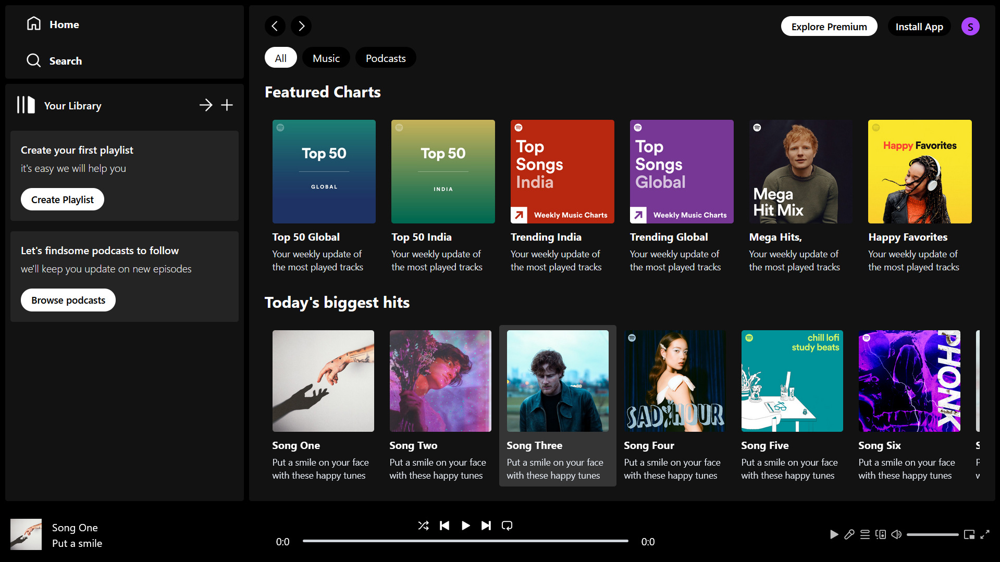
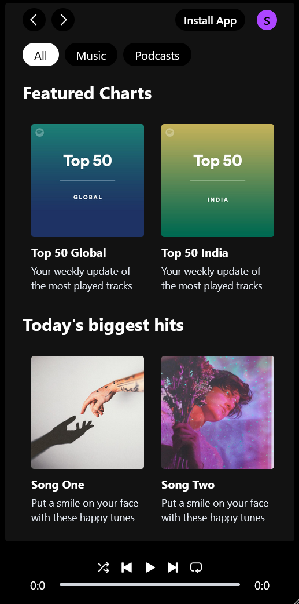

# 🎵 Spotify Clone

Welcome to the **Spotify Clone** project! using React and TailwindCss This is a web-based music player inspired by Spotify, built using modern web technologies. It features seamless audio playback, an interactive UI, and dynamic navigation.

## 🚀 Live Demo
[Click Here to View the Project](https://siddharth-ai.github.io/spotify/)

## 📝 Features
- 🎧 **Music Playback**: Play, pause, next, previous track controls.
- 🎚 **Seek Bar**: Interactive progress bar for song navigation.
- 🎵 **Playlist Support**: Browse and play from a song library.
- 🔍 **Search Functionality**: Easily find songs and albums.
- 🌟 **Responsive UI**: Mobile-friendly design with Tailwind CSS.
- 🔄 **React Router**: Enables smooth page navigation.
- 🎶 **Dynamic Album Display**: Shows album details and tracks.
- ⚡ **Optimized Performance**: Fast and efficient rendering with Vite.

## 🛠 Technologies Used
- **React.js**: Component-based UI development.
- **React Router**: Handles page navigation.
- **Context API**: Manages global state for music player.
- **Tailwind CSS**: Responsive and modern styling.
- **Vite**: Fast build tool for development.

## ScreenShot

# Desktop view :



# Mobile view :



## 📂 Project Structure
```
/spotify
 ├── /src
 │   ├── /components
 │   │   ├── AlbumItem.jsx
 │   │   ├── Display.jsx
 │   │   ├── DisplayAlbum.jsx
 │   │   ├── DisplayHome.jsx
 │   │   ├── Navbar.jsx
 │   │   ├── Player.jsx
 │   │   ├── Sidebar.jsx
 │   │   ├── SongItem.jsx
 │   ├── /context
 │   │   ├── PlayerContext.jsx
 │   ├── /assets
 │   │   ├── assets.js
 │   ├── App.jsx
 │   ├── package.json
 ├── index.html
 ├── tailwind.config.js
```

## 🏗️ Component Breakdown
### 📌 AlbumItem.jsx
- Displays an album item with its cover and name.
- Clickable to view album details.

### 📌 Display.jsx
- Main container to render different pages.
- Routes between home and album views.

### 📌 DisplayAlbum.jsx
- Shows selected album details.
- List of songs within the album.

### 📌 DisplayHome.jsx
- Homepage displaying featured albums and playlists.

### 📌 Navbar.jsx
- Top navigation bar for quick access to pages.

### 📌 Player.jsx
- Audio player UI with controls (play, pause, next, previous).
- Displays track progress and metadata.

### 📌 Sidebar.jsx
- Sidebar for navigation.
- Includes Home, Search, and Library sections.

### 📌 SongItem.jsx
- Individual song component.
- Click to play selected track.

## 🛠 Installation & Setup
1. **Clone the repository**
   ```sh
   git clone https://github.com/Siddharth-AI/spotify.git
   cd spotify
   ```
2. **Install dependencies**
   ```sh
   npm install
   ```
3. **Start development server**
   ```sh
   npm run dev
   ```
4. **Build for production**
   ```sh
   npm run build
   ```

## 🤝 Contributing
Contributions, issues, and feature requests are welcome! Feel free to fork the repo and submit a PR.

## 📬 Connect With Me
- **GitHub**: [Siddharth-AI](https://github.com/Siddharth-AI)
- **LinkedIn**: [Siddharth Shah](https://www.linkedin.com/in/siddharth-shah-a0003234a?utm_source=share&utm_campaign=share_via&utm_content=profile&utm_medium=android_app)

---
🚀 *Developed with passion using React, Tailwind CSS, and Vite.*

